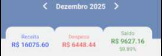

## Transações

Tudo é gerado a partir de uma transação, com elas o total de receitas, despesas e o saldo é atualizado.

### Navegação entre períodos

Veja as transações de cada mês clicando nas setas ao lado do Mẽs/Ano para navegar até ele.

### Totais

Na parte superior da listagem são exibidos três informações de totalizadores:

* **Receita**: É a soma de todas as receitas do mês em questão. Ou, se estiver em modo de seleção, a soma das transações de receita selecionadas;
* **Despesa**: É a soma de todas as depesas do mês em questão. Ou, se estiver em modo de seleção, a soma das transações de despesa selecionadas;
* **Saldo**: É o resultado do total de receitas menos o total de despesas. Junto ao saldo é exibido o percentual que representa o quanto de saldo sobrou em relação a receita.

Ao **clicar** no totalizar de **Receita** ou **Despesa**, serão listadas somente as trasações do tipo clicado. Se **clicar** no **Saldo** serão listadas todas as transações.

### Acessar tela de criação

Para criar uma transação **clique no botão "+"**, posicionado no lado inferior direito da tela, isto irá abrir a tela para criação.

> Este botão não aparece quando está em modo de seleção.

### Acessar tela de edição

Se for necessário editar uma transação, **dê um clique** nela e assim será aberta a tela para edição.

### Alterar status

Clique e **arraste a transação para a esquerda** para alterar o status atual (receita: recebida; despesa: paga).

### Excluir

Clique e **arraste a transação para a direita** para excluir.

### Selecionar

**Clique e segure** a transação para selecioná-la, ao fazer isso os [totais](totais) serão atualizados para o valor da(s) transação(ões) selecionada(s).

Ao clicar em um novo item (com apenas um clicque ou clique longo) este também será selecionado.

Para sair no *modo de seleção* clique no quarto ícone da direita para esquerda, no canto superior direito da tela.

### Filtrar

Para abrir a tela de filtros adicionais, clique no ícone de filtro no canto superior direito da página, segundo da direita para esquerda. 

### Gerar trasações recorrentes

Ao clicar no ícone de recorrência, primeiro da direita para esquerda, serão geradas as transações recorrentes (fixas) e as parcelas para o mês selecionado.